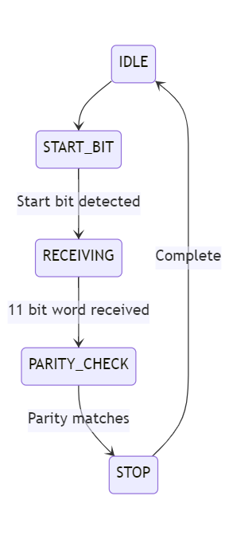

# PS/2 Controller
# TODO add a few sentence description

## Ports

### Inputs

- **`ps2_clk`** this is the clock signal for the ps/2 interface
- **`ps2_data`** this is the data receive signal for the ps/2 interface

### Outputs

- **`valid`** 1 bit flag asserted for one clock cycles. Specifies if the signal is received. It is a handshake signal. Valid flag is always raised regardless of paritiy check (see err)
- **`data[7:0]`** After the valid signal is asserted then data is valid. This contains the keyboard keys that are clicked.
- **`err`** If the parity does not match we raise an err flag. 

## Behavior
# TODO outline state machine

# PS/2

